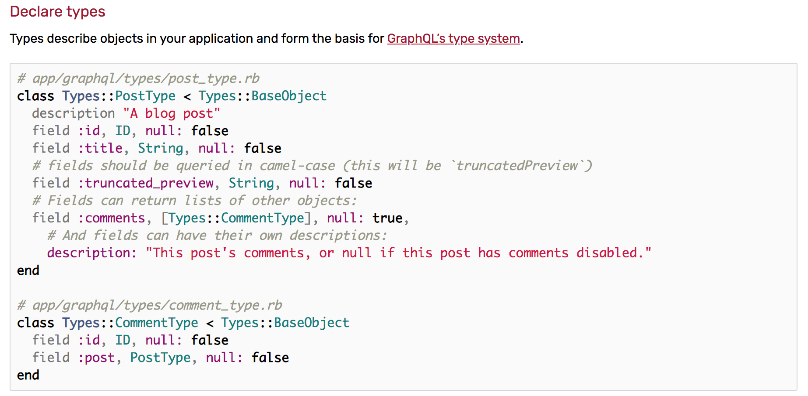
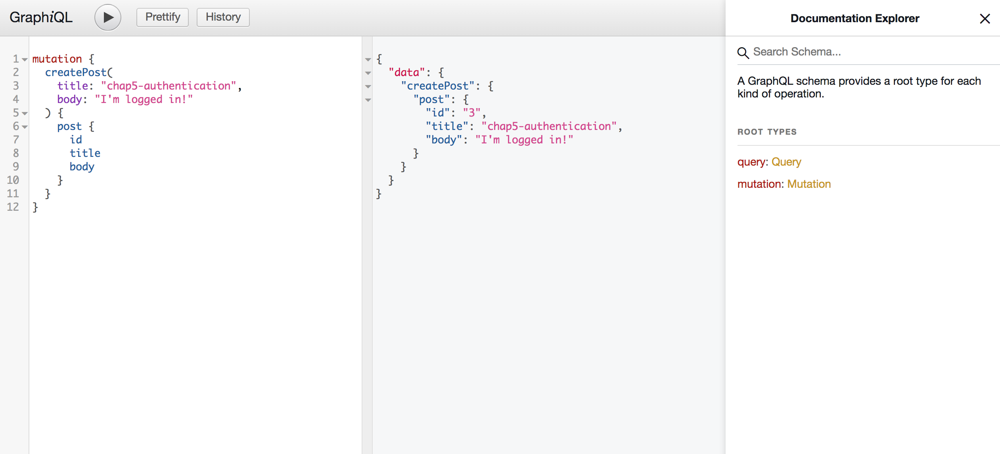

# Introduction
This is a graphql-ruby CRUD tutorial.

​

## What you will learn ?
- How to make CRUD app by using graphql-ruby

​

## Why CRUD ?
- Almost all rails programmers have experience of making CRUD application.
- I don't like tricky tutorial
- some tutorial like TODO app is not enough for me
- If you need specific feature, then read the official docs

​

## What is a good point of this tutorial ?

- Simple CRUD tutorial (User and Post model)
- This is a tutorial based on official docs


​
# Chap1 Rails Api App setup
**Goal of this chapter**

1. Just Create Rails Api app

​

`terminal`
```bash
rails new rails-api-graphql-crud-tuto --api -T --database=postgresql
cd rails-api-graphql-crud-tuto
rails db:create
git init
git add .
git commit -m "Initial Commit"
```

`-T` option is for...

`terminal`

```bash
  rails -h  ...  -T, [--skip-test], [--no-skip-test] # Skip test files
```


## Gem for auto check

​- [annotate_models](https://github.com/ctran/annotate_models) - Annotate Rails classes with schema and routes info

​

### - annotate_models​
To automatically annotate every time you run db:migrate 

`Gemfile`
```
group :development do
  gem 'annotate'
end
​```

`terminal`
```bash
bundle
rails g annotate:install
​
Running via Spring preloader in process 53096
create  lib/tasks/auto_annotate_models.rake
```

Ref: https://github.com/ctran/annotate_models#configuration-in-rails​

​

Finish!


# Chap2 `graphql-ruby` gem Setup
**Goal of this chapter**

1. Setup graphql-ruby
2. Setup graphiql-rails


**Related official docs part**: https://graphql-ruby.org/getting_started​

​
​
## 1. Install graphql-ruby gem
`Gemfile`
```
gem "graphql"
```

`terminal`
```bash
bundle
rails g graphql:install
​
​
Running via Spring preloader in process 49714
      create  app/graphql/types
      create  app/graphql/types/.keep
      create  app/graphql/rails_api_graphql_crud_tuto_schema.rb
      create  app/graphql/types/base_object.rb
      create  app/graphql/types/base_enum.rb
      create  app/graphql/types/base_input_object.rb
      create  app/graphql/types/base_interface.rb
      create  app/graphql/types/base_scalar.rb
      create  app/graphql/types/base_union.rb
      create  app/graphql/types/query_type.rb
add_root_type  query
      create  app/graphql/mutations
      create  app/graphql/mutations/.keep
      create  app/graphql/types/mutation_type.rb
add_root_type  mutation
      create  app/controllers/graphql_controller.rb
       route  post "/graphql", to: "graphql#execute"
Skipped graphiql, as this rails project is API only
  You may wish to use GraphiQL.app for development: https://github.com/skevy/graphiql-app
```

*Don't be afraid of the files created!

We stop here. Later we create `graphql:object`.

​

​

## 2. Install graphiql-rails gem
**Graphiql** is tool like below. we will use it later.
​
​

​

`Gemfile`
```
gem "graphiql-rails"
```


I want to use subdomain for api, so...

`config/routes.rb`
```ruby
Rails.application.routes.draw do
  constraints subdomain: 'api' do
    if Rails.env.development?
      mount GraphiQL::Rails::Engine, at: "/graphiql", graphql_path: "/graphql"
    end
​
    post "/graphql", to: "graphql#execute"
  end
end
```
​

`application.rb`
```ruby
# uncomment out this line
require "sprockets/railtie"
```

*This is only needed if you use subdomain.

`config/environments/development.rb`
```ruby
Rails.application.configure do
  ...
  # https://github.com/rails/rails/issues/12438
  # https://gist.github.com/indiesquidge/b836647f851179589765
  config.action_dispatch.tld_length = 0
end
```
​

Visit: http://api.localhost:3000/graphiql​
​
​
​
Finish!

# Chap3 Create model and Dummy data
**Goal of this chapter**
1. Create User and Post model
2. Create dummy data

*This chapter is not related with graphql-ruby!

## Step1. Create User
`terminal`
```bash
rails g model User name image
rails db:migrate
```

## Step2. Create Post model
`teminal`
```bash
rails g model Post title body user:references
rails db:migrate
```

## Step3. Edit user.rb
`models/user.rb`
```ruby
# == Schema Information
#
# Table name: users
#
#  id         :bigint(8)        not null, primary key
#  image      :string
#  name       :string
#  created_at :datetime         not null
#  updated_at :datetime         not null
#

class User < ApplicationRecord
  validates :name, presence: true # this is up to you
  has_many :posts, dependent: :destroy
end
```

## Step4. Edit post.rb
*This is validation is up to your use-case.


`models/post.rb`
```ruby
# == Schema Information
#
# Table name: posts
#
#  id         :bigint(8)        not null, primary key
#  body       :string
#  title      :string
#  created_at :datetime         not null
#  updated_at :datetime         not null
#  user_id    :bigint(8)
#
# Indexes
#
#  index_posts_on_user_id  (user_id)
#
# Foreign Keys
#
#  fk_rails_...  (user_id => users.id)
#

class Post < ApplicationRecord
  validates :title, presence: true
  validates :body, presence: true
  belongs_to :user
end
```

## Step5. Create dummy data
`Gemfile`
```
...
gem 'faker', :git => 'https://github.com/stympy/faker.git', :branch => 'master'
```

`terminal`
```bash
bundle
```

`terminal`
```bash
rails c
User.create(name: Faker::Name.name, image: Faker::Avatar.image)
Post.create(title: Faker::Book.title, body: Faker::Lorem.paragraph, user_id:1)
```
​
​Finish!

# Chap4 Query(GET)
**Goal of this chapter**
1. Implement Query(GET)

In this chapter we will try to implement Query.

**Query is equivalent to Rest GET request.**

## Step1 Edit `query_type.rb`

This is initial `graphql/types/query_type.rb` file.
```ruby
module Types
  class QueryType < Types::BaseObject
    # Add root-level fields here.
    # They will be entry points for queries on your schema.

    # TODO: remove me
    field :test_field, String, null: false,
      description: "An example field added by the generator"
    def test_field
      "Hello World!"
    end
  end
end
```

Add new query field `posts`
```ruby
field :posts, [PostType], null: true
def posts
  Post.all
end
```

So the `graphql/types/query_type.rb` is...

`graphql/types/query_type.rb`
```ruby
module Types
  class QueryType < Types::BaseObject
    # Add root-level fields here.
    # They will be entry points for queries on your schema.

    # TODO: remove me
    field :test_field, String, null: false,
      description: "An example field added by the generator"
    def test_field
      "Hello World!"
    end

    field :posts, [PostType], null: true
    def posts
      Post.all
    end
  end
end
```

This means...

- field posts is array of PostType and It is ok to return nullable value.
- posts method returns Post.all

## Step2 define `PostType`

Next, We need to define `PostType`


https://graphql-ruby.org/getting_started#getting-started

`terminal`
```bash
rails g graphql:object Post title:String body:String

Running via Spring preloader in process 62001
      create  app/graphql/types/post_type.rb
```

This generates the below code.
`types/post_type.rb`
```ruby
module Types
  class PostType < Types::BaseObject
    field :title, String, null: true
    field :body, String, null: true
  end
end
```

Imitate official guide, we will add `description` and `id`.

https://graphql-ruby.org/getting_started#declare-types

so...

`post_type.rb`
```ruby
module Types
  class PostType < Types::BaseObject
    description "A blog post"
    field :id, ID, null: false
    field :title, String, null: false
    field :body, String, null: true
  end
end
```
​
## Step3 Run query from graphiql

visit: http://api.localhost:3000/graphiql​

Query by using graphiql...


It works!!!


## Step4 Recap the flow
Here we will recap the flow!!!

1. query posts from graphiql 

​

Check the terminal log!

2. `POST "/graphql"` is fired.

3. It fires `GraphqlController#execute` action.

`terminal`
```bash
Started POST "/graphql" for 127.0.0.1 at 2019-03-12 15:09:45 +0800
Processing by GraphqlController#execute as */*
  Parameters: {"query"=>"query {\n  posts {\n    id\n    title\n    body\n  }\n}", "variables"=>nil, "subdomain"=>"api", "graphql"=>{"query"=>"query {\n  posts {\n    id\n    title\n    body\n  }\n}", "variables"=>nil}}
  Post Load (0.9ms)  SELECT "posts".* FROM "posts"
  ↳ app/controllers/graphql_controller.rb:10
Completed 200 OK in 40ms (Views: 0.3ms | ActiveRecord: 11.1ms)
```

4. In def execute action, query is executed.

`graphql_controller.rb`
```ruby
class GraphqlController < ApplicationController
  def execute
    variables = ensure_hash(params[:variables])
    query = params[:query]
    operation_name = params[:operationName]
    context = {
      # Query context goes here, for example:
      # current_user: current_user,
    }
    result = RailsApiGraphqlCrudTutoSchema.execute(query, variables: variables, context: context, operation_name: operation_name)
    render json: result
  rescue => e
    raise e unless Rails.env.development?
    handle_error_in_development e
  end
...
end
```
​

`RailsApiGraphqlCrudTutoSchema` is defined in...

`rails_api_graphql_crud_tuto_schema.rb`
```ruby
class RailsApiGraphqlCrudTutoSchema < GraphQL::Schema
  mutation(Types::MutationType)
  query(Types::QueryType)
end
```

`Types::QueryType` is defined in...

`types/query_type.rb`
```ruby
module Types
  class QueryType < Types::BaseObject
    # Add root-level fields here.
    # They will be entry points for queries on your schema.

    # TODO: remove me
    field :test_field, String, null: false,
      description: "An example field added by the generator"
    def test_field
      "Hello World!"
    end

    field :posts, [PostType], null: true
    def posts
      Post.all
    end
  end
end
```

`PostType` is defined in...

`types/post_type.rb`
```ruby
module Types
  class PostType < Types::BaseObject
    description "A blog post"
    field :id, ID, null: false
    field :title, String, null: false
    field :body, String, null: true
  end
end
```

So, finally we get the json result!

`result`
```
{
  "data": {
    "posts": [
      {
        "id": "1",
        "title": "Death Be Not Proud",
        "body": "Sapiente dignissimos veniam. Et eius velit. Quam dolorem id."
      }
    ]
  }
}
```
​

# Chap5 Mutation(CREATE)
**Goal of this chapter** 
- Implement feature to create post

In this chapter we will implement the feature to create a new post.

## Step1. Run generator command


https://graphql-ruby.org/schema/generators.html#scaffolding-mutations

`terminal`
```bash
rails g graphql:mutation create_post
Running via Spring preloader in process 63092
       exist  app/graphql/mutations
   identical  app/graphql/mutations/.keep
   identical  app/graphql/types/mutation_type.rb
add_root_type  mutation
      create  app/graphql/mutations/create_post.rb
        gsub  app/graphql/types/mutation_type.rb
```

This command creates `app/graphql/mutations/create_post.rb` and modify `app/graphql/types/mutation_type.rb`

`app/graphql/mutations/create_post.rb`
```ruby
module Mutations
  class CreatePost < GraphQL::Schema::RelayClassicMutation
    # TODO: define return fields
    # field :post, Types::PostType, null: false

    # TODO: define arguments
    # argument :name, String, required: true

    # TODO: define resolve method
    # def resolve(name:)
    #   { post: ... }
    # end
  end
end
```

`app/graphql/types/mutation_type.rb`
```ruby
module Types
  class MutationType < Types::BaseObject
    field :createPost, mutation: Mutations::CreatePost
    # TODO: remove me
    field :test_field, String, null: false,
      description: "An example field added by the generator"
    def test_field
      "Hello World"
    end
  end
end
```

## Step2. Create `base_mutation.rb`


https://graphql-ruby.org/mutations/mutation_classes.html#example-mutation-class

Create `graphql/mutations/base_mutation.rb`

```ruby
# We use GraphQL::Schema::Mutation not GraphQL::Schema::RelayClassicMutation# Because I use apollo-client
class Mutations::BaseMutation < GraphQL::Schema::Mutation
end
```

## Step3. Modify /mutations/create_post.rb


https://graphql-ruby.org/mutations/mutation_classes.html#example-mutation-class

Just imitate official docs.

`mutations/create_post.rb`
```ruby
module Mutations
  # inherit Mutations::BaseMutation
  class CreatePost < Mutations::BaseMutation
    # Define what type of value to be returned
    field :post, Types::PostType, null: false

    # Define what argument this mutation accepts
    argument :title, String, required: true
    argument :body, String, required: true

    def resolve(title:, body:)
      # we will use current_user in future
      user = User.first
      post = user.posts.new(title: title, body: body)
      # Here returns post field, which is defined above.
      if post.save
        {
          post: post,
          errors: [],
        }
      else
        # Failed save, return the errors to the client
        {
          post: nil,
          errors: post.errors.full_messages
        }
      end
    end
  end
end
```

## Step4 Test in grahpiql
### 1. createPost mutation


### 2. query posts again


Finish!

# Chap6 Authentication
**Goal of this chapter**
- Only logged in user can create post


**Related official docs**
- https://graphql-ruby.org/authorization/overview.html#what-about-authentication
- https://graphql-ruby.org/mutations/mutation_authorization.html

## Step1 Define `current_user` method
In `controllers/graphql_controller.rb`, we can see a comment how to use `current_user`.

`controllers/graphql_controller.rb`
```ruby
class GraphqlController < ApplicationController
  def execute
    variables = ensure_hash(params[:variables])
    query = params[:query]
    operation_name = params[:operationName]
    context = {
      # Query context goes here, for example:
      # current_user: current_user,
    }
    result = RailsApiGraphqlCrudTutoSchema.execute(query, variables: variables, context: context, operation_name: operation_name)
    render json: result
  rescue => e
    raise e unless Rails.env.development?
    handle_error_in_development e
  end
  ...
```

Okay let's uncomment this line.

`controllers/graphql_controller.rb`
```ruby
class GraphqlController < ApplicationController
  def execute
    ...
    context = {
      # Query context goes here, for example:
      current_user: current_user,
    }
    ...
```

We need to define `current_user` method.

`controllers/application_controller.rb`
```ruby
class ApplicationController < ActionController::API
  def current_user
    # If test situation when user is logged in
    User.first

    # If test situation when user is not logged in
    # nil
  end

  # This is actual my current_user method
  # current_user method depends on the person
  # def current_user
  #   token = AccessToken.find_token(bearer_token)

  #   if token && !token.expired?
  #     @current_user ||= token.user
  #   end
  # end
end
```

## Step2 Modify `create_post` mutation

Change this

```ruby
user = User.first
post = user.posts.new(title: title, body: body)
```
to

```ruby
post = context[:current_user].posts.new(title: title, body: body)
```
You can use context[:xxxxxxx] like this.

So entire code looks...

`mutations/create_post.rb`
```ruby
module Mutations
  # inherit Mutations::BaseMutation
  class CreatePost < Mutations::BaseMutation
    # Define what type of value to be returned
    field :post, Types::PostType, null: false

    # Define what argument this mutation accepts
    argument :title, String, required: true
    argument :body, String, required: true

    def resolve(title:, body:)
      # you can access current_user in context like this
      post = context[:current_user].posts.new(title: title, body: body)
      # Here returns post field, which is defined above.
      if post.save
        {
          post: post,
          errors: [],
        }
      else
        # Failed save, return the errors to the client
        {
          post: nil,
          errors: post.errors.full_messages
        }
      end
    end
  end
end
```

## Step3. Show error message when user is not logged in


https://graphql-ruby.org/mutations/mutation_authorization.html

`mutations/create_post.rb`
```ruby
module Mutations
  # inherit Mutations::BaseMutation
  class CreatePost < Mutations::BaseMutation    # https://stackoverflow.com/questions/3701264/passing-a-hash-to-a-function-args-and-its-meaning
    def ready?(**_args)
      if !context[:current_user]
        raise GraphQL::ExecutionError, "You need to login!"
      else
        true
      end
    end
    
    # Define what type of value to be returned
    field :post, Types::PostType, null: false

    # Define what argument this mutation accepts
    argument :title, String, required: true
    argument :body, String, required: true

    def resolve(title:, body:)
      # you can access current_user in context like this
      post = context[:current_user].posts.new(title: title, body: body)
      # Here returns post field, which is defined above.
      if post.save
        {
          post: post,
          errors: [],
        }
      else
        # Failed save, return the errors to the client
        {
          post: nil,
          errors: post.errors.full_messages
        }
      end
    end
  end
end
```

## Step4 Test it!
### 1. When there is logged-in user
*logged-in user is First User.



### 2. When user does not log in
Change current_user to `nil`
```ruby
class ApplicationController < ActionController::API
  def current_user
    # If test situation when user is logged in
    # User.first

    # If test situation when user is not logged in
    nil
  end
  ...
end
```


Finish!

## Chap7 Mutation(UPDATE)

**Goal of this chapter**
- implement the feature to update post

Ref: https://graphql-ruby.org/schema/generators.html#scaffolding-mutations

In this chapter, we will make post update mutation.

## Step1 Create `update_post` mutation

`terminal`
```bash
rails g graphql:mutation update_post
Running via Spring preloader in process 66514
       exist  app/graphql/mutations
   identical  app/graphql/mutations/.keep
        skip  app/graphql/types/mutation_type.rb
add_root_type  mutation
      create  app/graphql/mutations/update_post.rb
        gsub  app/graphql/types/mutation_type.rb
```

## Step2 modify `update_post.rb`

In https://graphql-ruby.org/mutations/mutation_errors, you can see the example of `post.update`


So, imitate this and modify code...

`mutations/update_post.rb`
```ruby
module Mutations
  # Don't forget to change to Mutations::BaseMutation
  class UpdatePost < Mutations::BaseMutation
    # Define what type of value to be returned
    field :post, Types::PostType, null: false

    # Define what argument this mutation accepts
    argument :id, ID, required: true    # Here we use input objects for practice, Explain soon!
    argument :attributes, Types::PostAttributes, required: true

    def resolve(id:, attributes:)
      post = Post.find(id)
      if post.update(attributes.to_h)
        { post: post }
      else
        raise GraphQL::ExecutionError, post.errors.full_messages.join(", ")
      end
    end
  end
end
```

## Step3 Define `PostAttributes`

You can find similar example here

https://graphql-ruby.org/type_definitions/input_objects.html#defining-input-object-types


create new file `graphql/types/post_attributes.rb`
```ruby
module Types
  class PostAttributes < Types::BaseInputObject
    description "Attributes for creating or updating a blog post"
    argument :title, String, "Header for the post", required: true
    argument :body, String, "Full body of the post", required: true
  end
end
```

Of course, you can refactor `create_post.rb` to use `PostAttributes`

## Step4 Test it!


# Chap8 Authorization
**Goal of this chapter**
- implement the feature to update post

**Reference to official docs**
https://graphql-ruby.org/mutations/mutation_authorization.html

## Step 1. Check the official docs example

Official docs guide recommends...
1. Loading and authorizing objects
2. Then, call def authorized? to check user can perform this action


https://graphql-ruby.org/mutations/mutation_authorization.html

## Step2. But...this is really confusing and it works only for Relay ?

*If you have better knowledge, please let me know!!

So, I take another option.

Look at below issue comment...

@rmosolgo says **"Current best practice is to put auth code at the top of the resolve function"**


Though, this is already "past" best practice, I tried this and it works well. So, I will take this option.

## Step3 Modify `update_post.rb`

`update_post.rb`
```ruby
module Mutations
  # Don't forget to change to Mutations::BaseMutation
  class UpdatePost < Mutations::BaseMutation
    # Define what type of value to be returned
    field :post, Types::PostType, null: false

    # Define what argument this mutation accepts
    argument :id, ID, required: true
    # Here we use input objects for practice
    argument :attributes, Types::PostAttributes, required: true

    def resolve(id:, attributes:)
      post = Post.find(id)
      # Add logic for authorization
      if post.user != context[:current_user]
        raise GraphQL::ExecutionError, "You are not authorized!"
      end
      if post.update(attributes.to_h)
        { post: post }
      else
        raise GraphQL::ExecutionError, post.errors.full_messages.join(", ")
      end
    end
  end
end
```

*Of course you can move authorization business logic to somewhere else like Pundit.

## Step4 Add authentication code

We already did this in CREATE Mutation.

`update_post.rb`
```ruby
module Mutations
  # Don't forget to change to Mutations::BaseMutation
  class UpdatePost < Mutations::BaseMutation
    def ready?(**_args)
      if !context[:current_user]
        raise GraphQL::ExecutionError, "You need to login!"
      else
        true
      end
    end
    
    # Define what type of value to be returned
    field :post, Types::PostType, null: false

    # Define what argument this mutation accepts
    argument :id, ID, required: true
    # Here we use input objects for practice
    argument :attributes, Types::PostAttributes, required: true

    def resolve(id:, attributes:)
      post = Post.find(id)
      # Add logic for authorization
      if post.user != context[:current_user]
        raise GraphQL::ExecutionError, "You are not authorized!"
      end
      if post.update(attributes.to_h)
        { post: post }
      else
        raise GraphQL::ExecutionError, post.errors.full_messages.join(", ")
      end
    end
  end
end
```


## Step5 Test it!

### 1 Create dummy user

```bash
rails cuser = User.create(name: Faker::Name.name, image: Faker::Avatar.image)Post.create(title: Faker::Book.title, body: Faker::Lorem.paragraph, user: user)
```

### 2 If not logged in


### 3 If logged in and Update other's post


```ruby
class ApplicationController < ActionController::API
  def current_user
    # If test situation when user is logged in
    User.first

    # If test situation when user is not logged in
    # nil
  end
end
```

Finish!

# Chap9 Mutation(DELETE)
This chapter we are doing just the same things we've already done!

## Step1 generate `destroy_post` mutation

```bash
rails g graphql:mutation destroy_post
```

## Step2 Edit `destroy_post` mutation

`destory_post.rb`
```ruby
module Mutations
  # Don't forget to change to Mutations::BaseMutation
  class DestroyPost < Mutations::BaseMutation
    def ready?(**_args)
      if !context[:current_user]
        raise GraphQL::ExecutionError, "You need to login!"
      else
        true
      end
    end
    # Just returning id is okay
    field :id, ID, null: true

    argument :id, ID, required: true

    def resolve(id:)
      post = Post.find(id)
      if post.user != context[:current_user]
        raise GraphQL::ExecutionError, "You are not authorized!"
      end
      post.destroy
      {
        id: id,
      }
    end
  end
end
```

## Step3 Test it!

### 1 Destroy existing post


### 2 query posts


*There is no id: "1" post.

Finish!
