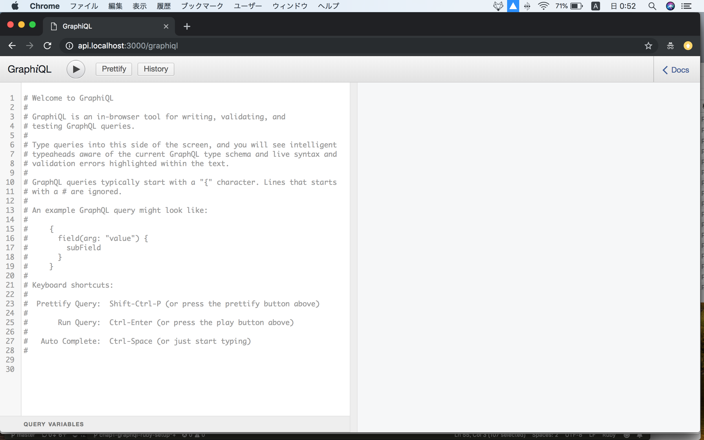

# Chap2 `graphql-ruby` gem Setup
**Goal of this chapter**

1. Setup graphql-ruby
2. Setup graphiql-rails


**Related official docs part**: https://graphql-ruby.org/getting_started​

​
​
## 1. Install graphql-ruby gem
`Gemfile`
```
gem "graphql"
```

`terminal`
```bash
bundle
rails g graphql:install
​
​
Running via Spring preloader in process 49714
      create  app/graphql/types
      create  app/graphql/types/.keep
      create  app/graphql/rails_api_graphql_crud_tuto_schema.rb
      create  app/graphql/types/base_object.rb
      create  app/graphql/types/base_enum.rb
      create  app/graphql/types/base_input_object.rb
      create  app/graphql/types/base_interface.rb
      create  app/graphql/types/base_scalar.rb
      create  app/graphql/types/base_union.rb
      create  app/graphql/types/query_type.rb
add_root_type  query
      create  app/graphql/mutations
      create  app/graphql/mutations/.keep
      create  app/graphql/types/mutation_type.rb
add_root_type  mutation
      create  app/controllers/graphql_controller.rb
       route  post "/graphql", to: "graphql#execute"
Skipped graphiql, as this rails project is API only
  You may wish to use GraphiQL.app for development: https://github.com/skevy/graphiql-app
```

*Don't be afraid of the files created!

We stop here. Later we create `graphql:object`.

​

​

## 2. Install graphiql-rails gem
**Graphiql** is tool like below. we will use it later.
​
​

​

`Gemfile`
```
gem "graphiql-rails"
```


I want to use subdomain for api, so...

`config/routes.rb`
```ruby
Rails.application.routes.draw do
  constraints subdomain: 'api' do
    if Rails.env.development?
      mount GraphiQL::Rails::Engine, at: "/graphiql", graphql_path: "/graphql"
    end
​
    post "/graphql", to: "graphql#execute"
  end
end
```
​

`application.rb`
```ruby
# uncomment out this line
require "sprockets/railtie"
```

*This is only needed if you use subdomain.

`config/environments/development.rb`
```ruby
Rails.application.configure do
  ...
  # https://github.com/rails/rails/issues/12438
  # https://gist.github.com/indiesquidge/b836647f851179589765
  config.action_dispatch.tld_length = 0
end
```
​

Visit: http://api.localhost:3000/graphiql​
​
​
​
Finish!

