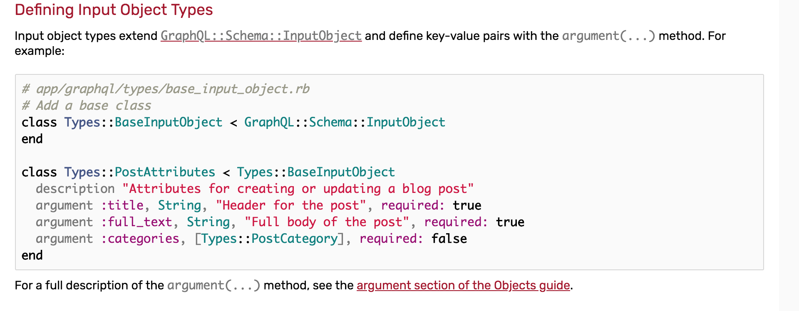
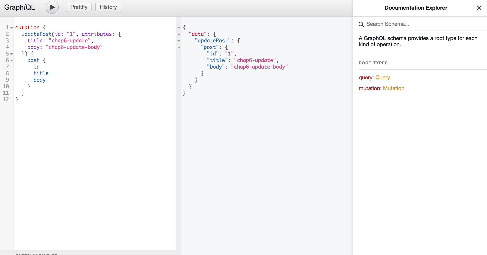

# Chap7 Mutation(UPDATE)

!!! abstract "Goal of this chapter"
    - implement the feature to update post

Ref: https://graphql-ruby.org/schema/generators.html#scaffolding-mutations

In this chapter, we will make post update mutation.

## Step1 Create `update_post` mutation

`terminal`
```bash
rails g graphql:mutation update_post
Running via Spring preloader in process 66514
       exist  app/graphql/mutations
   identical  app/graphql/mutations/.keep
        skip  app/graphql/types/mutation_type.rb
add_root_type  mutation
      create  app/graphql/mutations/update_post.rb
        gsub  app/graphql/types/mutation_type.rb
```

## Step2 modify `update_post.rb`

In https://graphql-ruby.org/mutations/mutation_errors, you can see the example of `post.update`


So, imitate this and modify code...

`mutations/update_post.rb`
```ruby
module Mutations
  # Don't forget to change to Mutations::BaseMutation
  class UpdatePost < Mutations::BaseMutation
    # Define what type of value to be returned
    field :post, Types::PostType, null: false

    # Define what argument this mutation accepts
    argument :id, ID, required: true    # Here we use input objects for practice, Explain soon!
    argument :attributes, Types::PostAttributes, required: true

    def resolve(id:, attributes:)
      post = Post.find(id)
      if post.update(attributes.to_h)
        { post: post }
      else
        raise GraphQL::ExecutionError, post.errors.full_messages.join(", ")
      end
    end
  end
end
```

## Step3 Define `PostAttributes`

You can find similar example here

https://graphql-ruby.org/type_definitions/input_objects.html#defining-input-object-types



create new file `graphql/types/post_attributes.rb`
```ruby
module Types
  class PostAttributes < Types::BaseInputObject
    description "Attributes for creating or updating a blog post"
    argument :title, String, "Header for the post", required: true
    argument :body, String, "Full body of the post", required: true
  end
end
```

Of course, you can refactor `create_post.rb` to use `PostAttributes`

## Step4 Test it!


