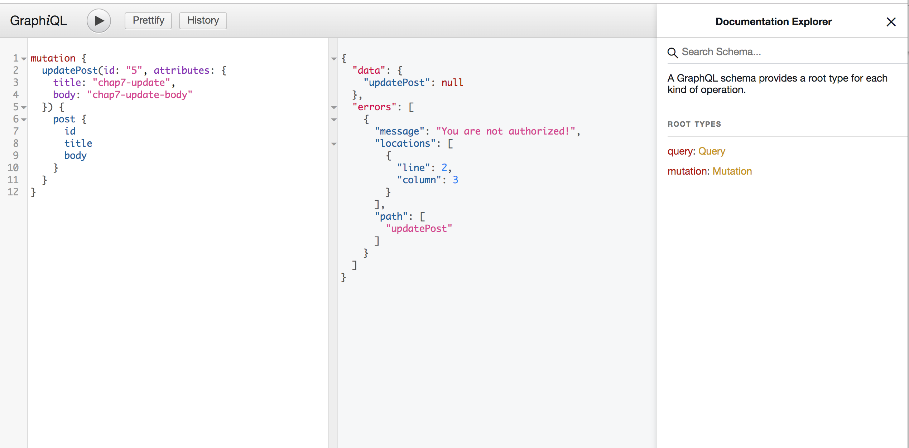

# Chap8 Authorization
!!! abstract "Goal of this chapter"
    - implement the feature to update post

**Reference to official docs**
https://graphql-ruby.org/mutations/mutation_authorization.html

## Step 1. Check the official docs example

Official docs guide recommends...
1. Loading and authorizing objects
2. Then, call def authorized? to check user can perform this action


https://graphql-ruby.org/mutations/mutation_authorization.html

## Step2. But...this is really confusing and it works only for Relay ?

*If you have better knowledge, please let me know!!

So, I take another option.

Look at below issue comment...

@rmosolgo says **"Current best practice is to put auth code at the top of the resolve function"**


Though, this is already "past" best practice, I tried this and it works well. So, I will take this option.

## Step3 Modify `update_post.rb`

`update_post.rb`
```ruby
module Mutations
  # Don't forget to change to Mutations::BaseMutation
  class UpdatePost < Mutations::BaseMutation
    # Define what type of value to be returned
    field :post, Types::PostType, null: false

    # Define what argument this mutation accepts
    argument :id, ID, required: true
    # Here we use input objects for practice
    argument :attributes, Types::PostAttributes, required: true

    def resolve(id:, attributes:)
      post = Post.find(id)
      # Add logic for authorization
      if post.user != context[:current_user]
        raise GraphQL::ExecutionError, "You are not authorized!"
      end
      if post.update(attributes.to_h)
        { post: post }
      else
        raise GraphQL::ExecutionError, post.errors.full_messages.join(", ")
      end
    end
  end
end
```

*Of course you can move authorization business logic to somewhere else like Pundit.

## Step4 Add authentication code

We already did this in CREATE Mutation.

`update_post.rb`
```ruby
module Mutations
  # Don't forget to change to Mutations::BaseMutation
  class UpdatePost < Mutations::BaseMutation
    def ready?(**_args)
      if !context[:current_user]
        raise GraphQL::ExecutionError, "You need to login!"
      else
        true
      end
    end
    
    # Define what type of value to be returned
    field :post, Types::PostType, null: false

    # Define what argument this mutation accepts
    argument :id, ID, required: true
    # Here we use input objects for practice
    argument :attributes, Types::PostAttributes, required: true

    def resolve(id:, attributes:)
      post = Post.find(id)
      # Add logic for authorization
      if post.user != context[:current_user]
        raise GraphQL::ExecutionError, "You are not authorized!"
      end
      if post.update(attributes.to_h)
        { post: post }
      else
        raise GraphQL::ExecutionError, post.errors.full_messages.join(", ")
      end
    end
  end
end
```


## Step5 Test it!

### 1 Create dummy user

```bash
rails cuser = User.create(name: Faker::Name.name, image: Faker::Avatar.image)Post.create(title: Faker::Book.title, body: Faker::Lorem.paragraph, user: user)
```

### 2 If not logged in


### 3 If logged in and Update other's post


```ruby
class ApplicationController < ActionController::API
  def current_user
    # If test situation when user is logged in
    User.first

    # If test situation when user is not logged in
    # nil
  end
end
```

Finish!

